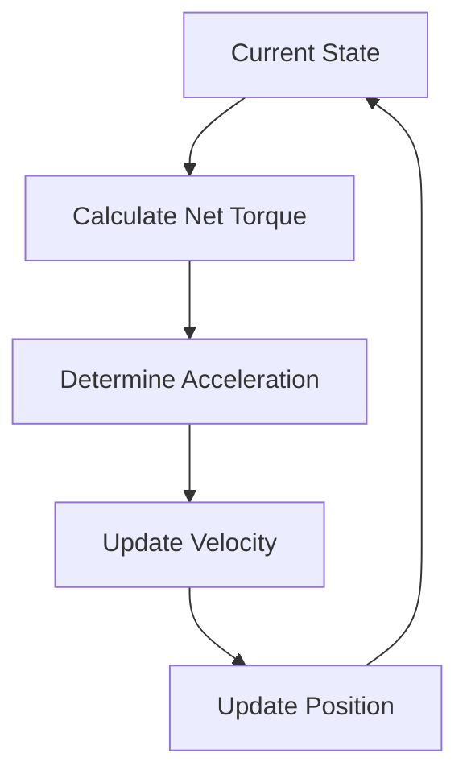

# The Dance of the Robotic Arm: A Symphony of Physics and Control

> *"In the delicate balance between gravity and motor power, we find the art of robotic arm control."*

## The Challenge

[IMAGE_PLACEHOLDER: A technical diagram of a robotic arm in different positions, with force vectors showing gravity, motor torque, and friction. Include annotations for key components and measurements.]

Picture a robotic arm reaching for an object. As it moves, it battles against gravity, fights friction, and must maintain precise control. This is the challenge we solve through our advanced simulation and optimization system.

## The Forces at Play

### 1. The Gravity Tango
Gravity is the constant dance partner of our robotic arm. Its influence changes with every angle:

[IMAGE_PLACEHOLDER: A graph showing gravity torque vs. angle, with annotations for maximum and minimum torque points. Include a small inset showing the arm position at these points.]

To find the gravity torque equation, we use a quadratic fit approach. The gravity test function measures the DC motor torque (TODO: through this relationship) required to hold the arm at various angles. By collecting data points across different arm positions and applying quadratic regression, we can derive the following equation:

Gravity Torque = a*(armAngle +b) -k (a b and k are all constants)

This allows us to know how much torque gravity is applying at all times

### 2. The Motor's Power
Our motors are the heart of the system, converting electrical energy into mechanical motion:

[IMAGE_PLACEHOLDER: A graph showing motor torque characteristics, including stall torque, free speed, and the torque-speed curve. Include efficiency regions and thermal limits.]

```math
τ_motor = Kt * I
```

Where:
- Kt: motor torque constant
- I: current

### 3. The Friction Waltz
Friction is the subtle resistance that must be overcome:

[IMAGE_PLACEHOLDER: A diagram showing different types of friction (static, dynamic, viscous) and their effects on arm movement. Include velocity vs. friction force curves.]

```math
τ_friction = b * ω
```

Where:
- b: friction coefficient
- ω: angular velocity

## The Simulation Canvas

### The Time Step Dance
Each moment in our simulation is a carefully choreographed sequence:

[IMAGE_PLACEHOLDER: A detailed flowchart showing the simulation loop, with data flow between physics calculations, control updates, and state management.]



### The PID Conductor
Our PID controller acts as the conductor of this mechanical orchestra:

[IMAGE_PLACEHOLDER: A graph showing the effect of each PID component (P, I, D) on the system response. Include examples of good and bad tuning.]

| Component | Role | Effect |
|-----------|------|---------|
| Proportional | Immediate Response | Quick initial movement |
| Integral | Error Correction | Eliminates steady-state error |
| Derivative | Damping | Prevents overshooting |

## The Motor Library

Our comprehensive FTC motor library is like a well-organized music sheet:

[IMAGE_PLACEHOLDER: A comparison chart showing different motor types with their torque-speed curves, efficiency maps, and key specifications.]

| Motor Type | Characteristics | Best For |
|------------|-----------------|-----------|
| NeveRest | High Torque | Heavy Loads |
| REV HD | High Speed | Quick Movements |
| GoBILDA | Balanced | General Purpose |

## The Validation Process

### 1. Theoretical Validation
- Mathematical proof of stability
- Energy conservation verification
- Boundary condition testing

[IMAGE_PLACEHOLDER: A diagram showing the validation process, including mathematical proofs, simulation results, and real-world testing data.]

### 2. Empirical Validation
- Real-world performance testing
- Friction coefficient calibration
- Inertia measurement

[IMAGE_PLACEHOLDER: A graph comparing theoretical vs. actual performance, with error bars and confidence intervals. Include key metrics and success criteria.]

## Applications

Our arm simulation has been successfully applied to:
- FTC Competition Robots
- Educational Demonstrations
- Research Projects
- Custom Robotic Systems

[IMAGE_PLACEHOLDER: A gallery of different applications showing the arm simulation in action, including competition robots, educational setups, and research platforms.]

---

*"In the harmony of physics and control, we find the perfect balance for robotic precision."* 