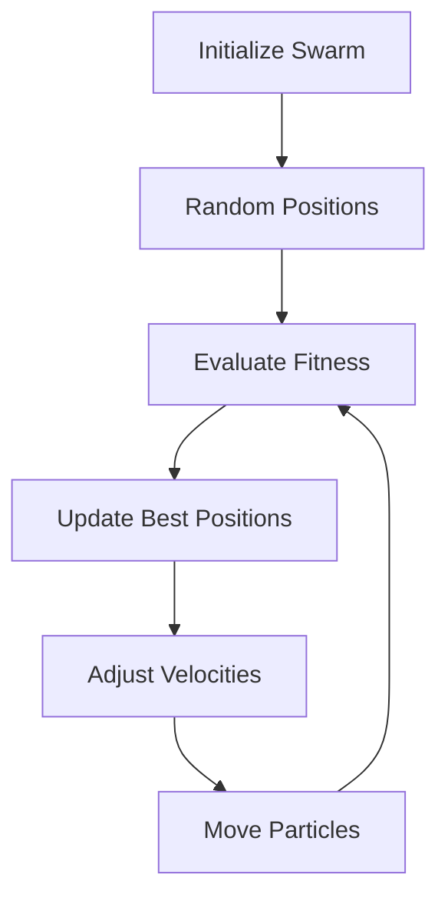

# The Art of PID Tuning: A Swarm Intelligence Approach

> *"In the quest for perfect control, we turn to nature's wisdom - where the collective intelligence of a swarm leads to optimal solutions."*

## Introduction

[IMAGE_PLACEHOLDER: A diagram showing a flock of birds searching for food, with arrows indicating their movement patterns and information sharing. The image should transition to a 3D space showing particles searching for optimal PID parameters.]

Imagine a group of birds searching for food in a vast landscape. Each bird remembers its best find and shares this information with others, leading the entire flock to the most abundant food source. This is the essence of Particle Swarm Optimization (PSO) - a powerful algorithm that mimics this natural behavior to solve complex optimization problems.

In our PID Tuners project, we've harnessed this natural wisdom to solve one of robotics' most challenging problems: finding the perfect PID parameters.

## The PSO Journey

### 1. The Swarm Awakens
Each particle in our swarm represents a potential solution - a unique combination of PID parameters (Kp, Ki, Kd). Like birds in flight, these particles explore the vast parameter space, learning from their experiences and from each other.

[IMAGE_PLACEHOLDER: A 3D scatter plot showing particles distributed in PID parameter space, with color gradients indicating fitness values. Include arrows showing particle movement vectors.]

### 2. The Dance of Optimization
The particles move through the parameter space in a beautiful dance of optimization:

- **Personal Best**: Each particle remembers its best performance
- **Global Best**: The swarm shares its collective wisdom
- **Velocity Updates**: Particles adjust their movement based on both personal and global knowledge
- **Position Updates**: New solutions emerge from this collaborative exploration

[IMAGE_PLACEHOLDER: A series of frames showing particle movement over time, with trails indicating their paths and highlighting the convergence toward optimal solutions.]

### 3. The Convergence
As the swarm evolves, particles begin to converge toward optimal solutions. This convergence is not just mathematical - it's the emergence of order from chaos, much like a flock of birds finding their perfect formation.

[IMAGE_PLACEHOLDER: A final state diagram showing particles clustered around the optimal solution, with a clear convergence pattern visible.]

## PSO in Action: PID Tuning

### The Fitness Function
Our fitness function evaluates how well each set of PID parameters performs:

[IMAGE_PLACEHOLDER: A graph showing different PID responses (overdamped, underdamped, critically damped) with their corresponding fitness scores. Include annotations for rise time, settling time, and overshoot.]

| Metric | Description | Weight |
|--------|-------------|---------|
| Rise Time | How quickly the system reaches target | High |
| Settling Time | Time to stabilize | High |
| Overshoot | Maximum deviation from target | Medium |
| Steady-state Error | Final position accuracy | High |

### The Optimization Process
1. **Initialization**: Particles spread across the parameter space
2. **Evaluation**: Each particle's performance is simulated
3. **Learning**: Particles update their knowledge
4. **Movement**: New solutions are explored
5. **Convergence**: Optimal parameters emerge

[IMAGE_PLACEHOLDER: A flowchart showing the complete optimization process, with visual representations of each step and data flow between components.]

## Advantages of Our Approach

### 1. Global Perspective
Unlike traditional methods, PSO explores the entire parameter space, avoiding local optima.

[IMAGE_PLACEHOLDER: A comparison diagram showing traditional gradient descent (getting stuck in local optima) versus PSO (finding global optimum).]

### 2. Natural Intelligence
- No need for complex derivatives
- Inspired by natural systems
- Robust to noise and non-linearity

### 3. Parallel Processing
Multiple parameter sets are evaluated simultaneously, making the process efficient and thorough.

[IMAGE_PLACEHOLDER: A diagram showing parallel evaluation of multiple parameter sets, with a visual representation of the speedup compared to sequential processing.]

## Implementation Details

### The Simulation Engine
Our custom simulation engine provides the foundation for PSO:
- Real-time performance evaluation
- Accurate system modeling
- Fast parameter testing

[IMAGE_PLACEHOLDER: An architecture diagram showing the components of the simulation engine, including the physics model, PID controller, and evaluation system.]

### Validation Process
1. **Theoretical Validation**
   - Mathematical proof of convergence
   - Stability analysis
   - Performance bounds

2. **Practical Validation**
   - Real-world testing
   - Performance comparison
   - Robustness verification

[IMAGE_PLACEHOLDER: A comparison chart showing theoretical vs. practical performance metrics, with error bars and confidence intervals.]

## Applications

Our PSO-based PID tuner has been successfully applied to:
- [Robotic Arms](ArmMechanism.md)
- Linear Slides (coming soon)
- Custom Mechanisms
- Educational Demonstrations

[IMAGE_PLACEHOLDER: A collage of different applications showing the PID tuner in action on various robotic systems.]

## Further Reading
- [Arm Mechanism Documentation](ArmMechanism.md)

---